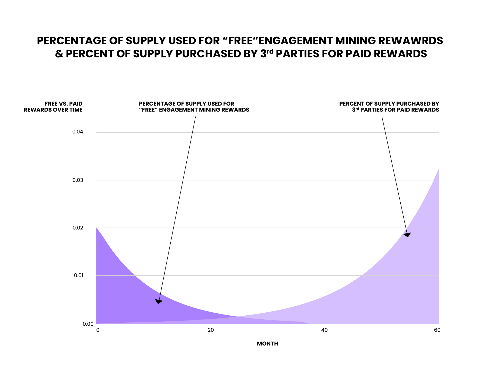

# Rewards

Anyone can offer “proof of work” **Rewards** to Farcaster Members by acquiring MOXIE tokens and staking them into the Rewards contract.

Rewards are provided to Members who complete certain actions. Some examples of rewards include:

- Rewarding Members for quality content creations

- Rewarding developers for building valuable frames

- Rewarding Members for promoting certain frames and achieving engagement

- Rewarding Members for onboarding additional qDAU active users to Farcaster

- Rewarding Members for interacting with advertisements or trying new products

The Moxie Protocol verifies that actions are completed and then issues the rewards according to the splits defined by the [Payouts](https://build.moxie.xyz/the-moxie-protocol/moxie-protocol/payouts) protocol.

To kickstart the protocol rewards and demonstrate their effectiveness, Moxie has partnered with [Airstack](https://airstack.xyz/), one of the leading developers on Farcaster. Several other 3rd party projects are teed up to use Moxie Rewards at launch.

## Rewards Tested, Optimized, and Issued Prior to Launch

Since March 2024 Airstack has been issuing various offchain Rewards to Farcaster Members as a method of testing many of the potential Moxie concepts before bringing them onchain. Some examples that were tested include:

- Earn Rewards for high quality Casts and Replies.

- Earn Rewards for each unique Member who uses a Frame

- Earn Rewards for each unique Member who uses a product

- Earn Rewards for each unique Member who transacts in a Frame

## Rewards at Launch & Ongoing

The following Rewards will be offered at launch.

| Reward                                                                         | Targeted To      | Type         | Paid for By                              |
| ------------------------------------------------------------------------------ | ---------------- | ------------ | ---------------------------------------- |
| **Earn MOXIE Rewards for high quality Casts and Replies**                      | Content Creators | Common Goods | Protocol, Engagement Mining              |
| **Earn MOXIE Rewards the first time a builder runs an API call with Airstack** | Developers       | 3rd Party    | Airstack                                 |
| **Earn MOXIE Rewards when using or sharing Airstack Frames**                   | Members          | 3rd Party    | Airstack                                 |
| **Advertising new Products in Frames**                                         | Members          | 3rd Party    | Many Such Companies signed up for launch |

## Common Goods Rewards

The Rewards for high quality Farcaster content creation has been determined by the Moxie Protocol Foundation to be "Common Goods" Rewards that are in the best interest of the protocol, and will be provisioned out of the 15% of Moxie Tokens earmarked for ongoing Engagement Mining.

Any project can present a "Common Goods" proposal to the Moxie Foundation for an allocation from the Engagement Mining bucket. The Moxie DAO shall establish a process for reviewing and voting on such grant requests.

Rewards provisioned from the Engagement Mining bucket shall be inflation adjusted in accordance with the overall growth of the Farcaster Network and any changes in the MOXIE price, and managed by the Moxie DAO.

## 3rd Party Rewards

Anyone is able to acquire MOXIE from exchanges and use it to sponsor 3rd party rewards that are in the self-interest of the 3rd party.

## Forecast

The "Free" Common Goods Engagement Mining Rewards are intended to kick-start the network effects while providing value to the entire Farcaster ecosystem. Very rapidly we forecast paid 3rd party rewards eclipsing the free rewards as new advertising models and primitives are launched on top of the Moxie Protocol.

Airstack is providing frames and actions for 3rd parties to easily publish Rewards. To get started all they will need to do is purchase MOXIE from decentralized exchanges and have Airstack program their rewards. Airstack is also building no-code frames and actions for easily publishing rewards.

Alternatively organizations can acquire MOXIE and build their own Rewards, leveraring the Moxie protocol for all earnings, fan tokens, and payouts.
