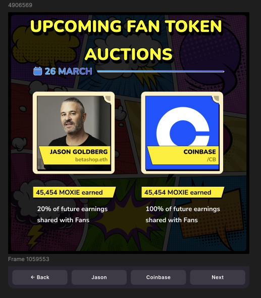
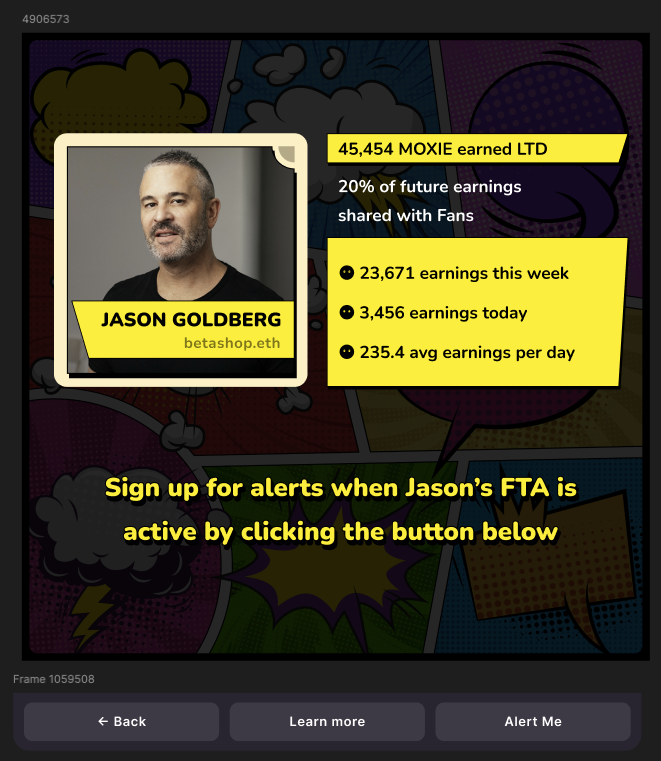
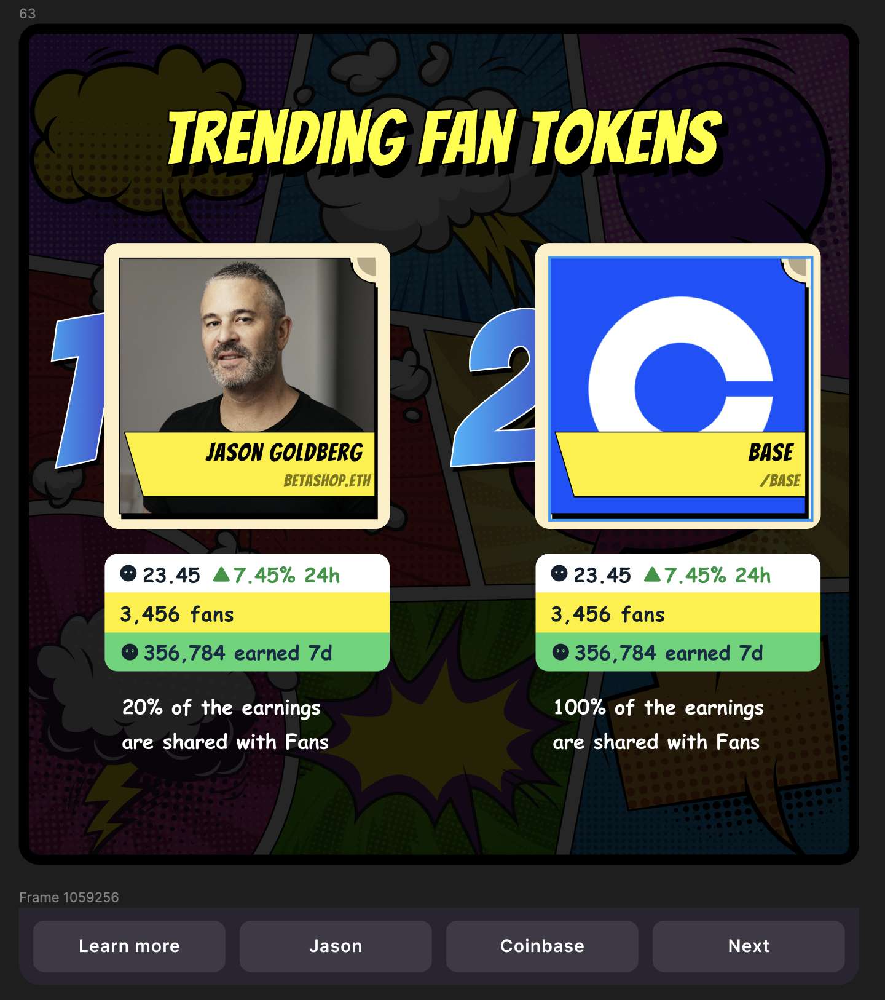
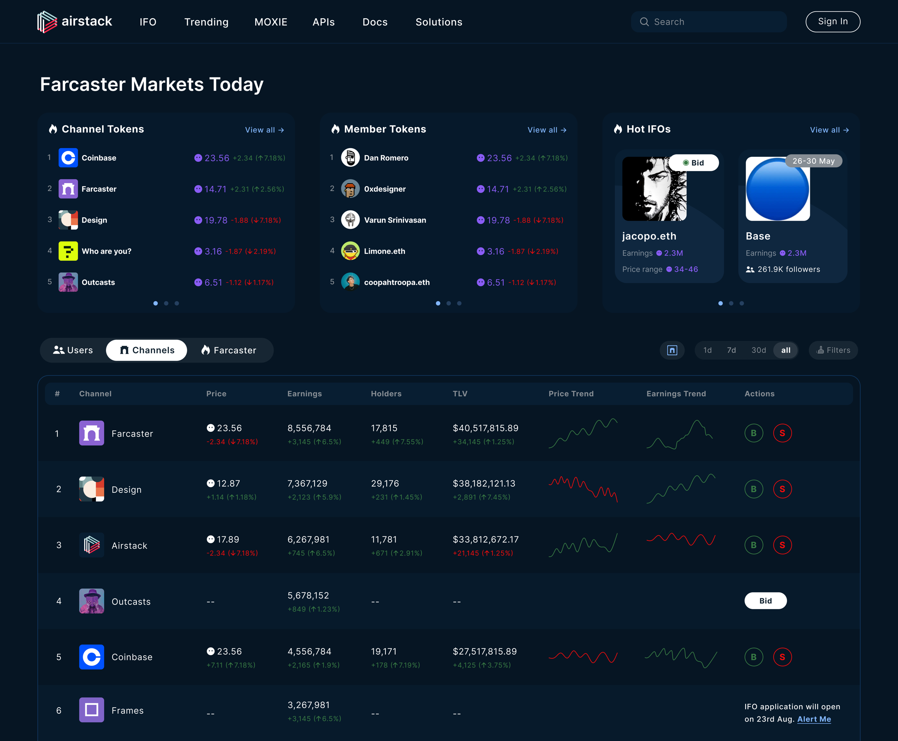
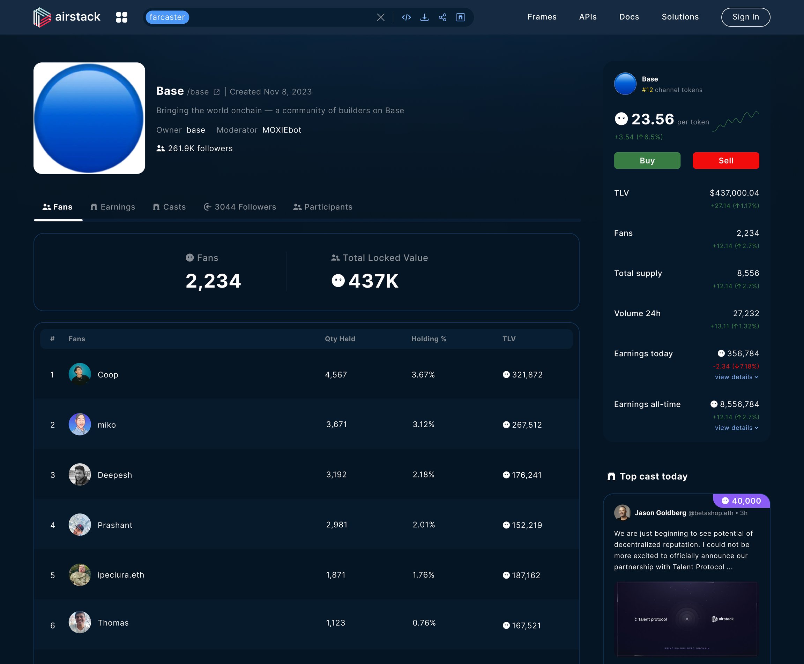
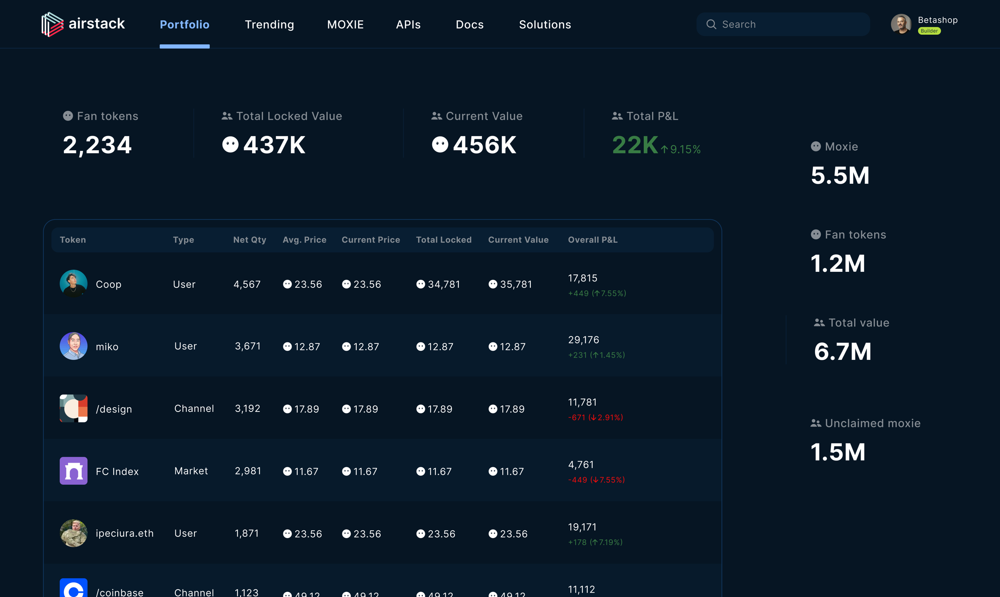

# User Experience

Anyone can freely build frames, app, websites on top of the protocol. Below are some experiences that Airstack is developing for the Moxie launch.

--

**This screenshot shows a frame announcing upcoming Fan Token Auctions**

**This screenshot shows a Member signing up for alerts for upcoming Fan Token Auctions ("FTA")**

**This screenshot shows a user bidding on an active Fan Token Auction**

**This screenshot shows an Airstack dashboard with upcoming Fan Token Auctions**

**This screenshot shows an Airstack dashboard with Trending Farcaster Fan Tokens**

**This screenshot shows an Airstack dashboard for the Base Channel Fans**

**This screenshot shows an Airstack dashboard for a Member's Fan Token Portfolio**

