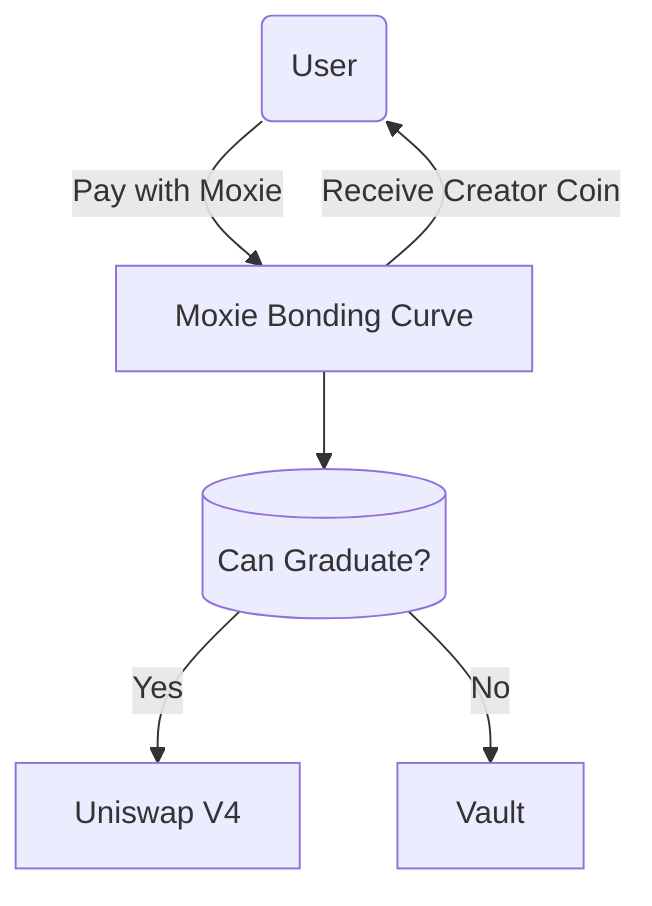
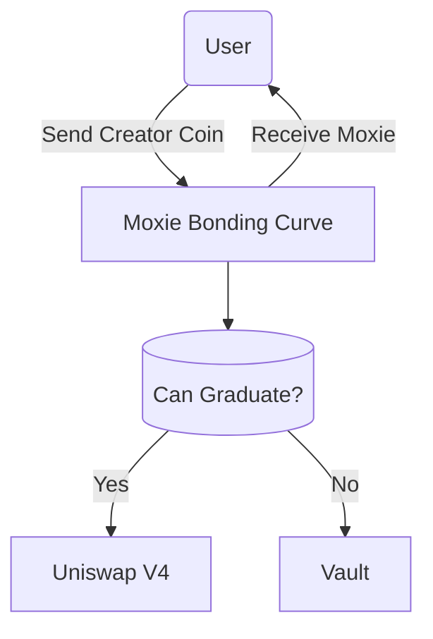

# Bonding Curves

Within the Moxie protocol, the Bonding Curve contract plays a central role in the lifecycle of a creator coin. Its primary function is to set the coin’s price during buy and sell transactions based on the circulating supply and a predetermined reserve ratio.

The Bonding Curve supports several pricing models, each defined by a specific reserve ratio. The initial configuration for each pricing curve is as follows:

| Price Curve  | Reserve Ratio | Pre-sale Supply |
| :----------- | :------------ | :-------------- |
| Conservative | 0.80          | 40,000          |
| Moderate     | 0.66          | 20,000          |
| Based        | 0.55          | 10,000          |
| Supa Based   | 0.40          | 5,000           |

## Auction

Every creator coin launched through the Moxie protocol begins with an auction, during which its price is determined by bids from participating Moxie users. Although the auction process is managed by the EasyAuction contract, the Bonding Curve contract is responsible for issuing the creator coins and initializing their bonding curves.

Once a creator coin reaches a market capitalization of **25 million Moxie**, it automatically graduates to the Uniswap V4 pool. At that point, its price is determined by Uniswap V4 rather than by the Bonding Curve.

To learn more about the Uniswap V4 Graduation, click [here](./02-bonding-curves.mdx#uniswap-v4-graduation).

## Buy & Sell

The Bonding Curve contract serves as the primary interface for users buying and selling creator coins.

**Buying Process:**

1. The user pays with Moxie tokens to the Bonding Curve contract.
2. The contract checks whether the creator coin has graduated:
   - If graduated: It initiates a transition to the Uniswap V4 pool and purchases the creator coin directly from Uniswap on behalf of the user.
   - If not graduated: The received Moxie tokens are stored in the `Vault` contract.
3. The user then receives the creator coin—either minted directly (if not graduated) or forwarded from Uniswap (if graduated).

**Selling Process:**

1. The user sends the creator coin to the Bonding Curve contract.
2. The contract checks whether the creator coin has graduated:
   - If graduated: It transitions to the Uniswap V4 pool to sell the coin directly on behalf of the user.
   - If not graduated: The coin is burned from the circulating supply.
3. In return, the user receives Moxie tokens.

## Uniswap V4 Graduation

Graduation to Uniswap V4 is the process of launching a dedicated liquidity pool for a creator coin, pairing it with Moxie tokens sourced from the `Vault` contract. This process is automatically triggered during a buy or sell transaction once the creator coin reaches a market capitalization of 25 million Moxie.

After graduation, the creator coin can be freely traded on Uniswap against any supported token trading on Uniswap, with its price now determined by the Uniswap V4 pool rather than the Bonding Curve.
