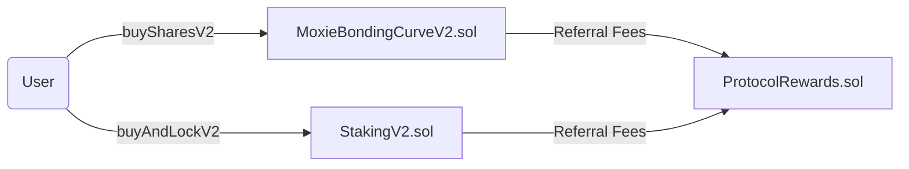
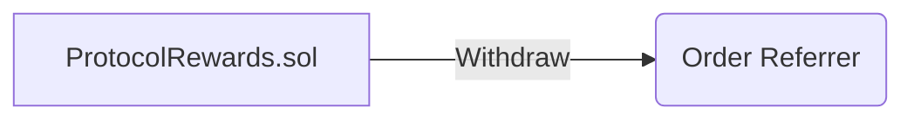

import DeveloperSupport from "../../../partial/_developer_support.mdx";

# Referral Fees

## Overview

Referral fees are rewards provided to third parties for facilitating user activities such as buying, selling, or auctioning a Fan Token on the Moxie protocol.

The Moxie protocol offers three types of referral fees:

- **Auction Referral Fees**
- **Buy/Sell Referral Fees**
- **Signup Referral Fees** (_Launching mid-December 2024_)

Each type has a unique fee split structure. For detailed information about referral fees and their respective split structures, visit [here](https://build.moxie.xyz/the-moxie-protocol).

The first two referral fee types—Auction and Buy/Sell—are available starting **December 4, 2024**, following the deployment of the new `ProtocolRewards.sol` contract.

This release also includes upgrades to several existing contracts, including:

- [`MoxieBondingCurve.sol`](../../contract/03-references/01-moxiebondingcurve.mdx)
- [`Staking.sol`](../../contract/03-references/06-staking.mdx)
- [`SubjectFactory.sol`](../../contract/03-references/07-subjectfactory.mdx)

For more details on the contract upgrades, refer to the [December 4, 2024 contract changelog](../../contract/04-changelog.mdx#december-4-2024).

## Contract Architecture

Referral fees are primarily managed by the `ProtocolRewards.sol` contract. This singleton contract is deployed once and handles the deposit and withdrawal of all referral fees.

Currently, only referrals on buy/sell transactions can included independently on-chain by calling the relevant smart contract functions.

Auction referrals, however, can only be made through [moxie.xyz](https://moxie.xyz).

### Buy/Sell Referral Fees

For every buy and sell Fan Token transactions that occurs on your platform, you can include your address as a referrer to receive the referral fees from each transaction.

This can be done easily by calling "v2" functions added from the [December 4, 2024 contract upgrade](../../contract/04-changelog.mdx#december-4-2024) in both the [`MoxieBondingCurveV2.sol`](../../contract/03-references/01-moxiebondingcurve.mdx) and [`StakingV2.sol`](../../contract/03-references/06-staking.mdx) contracts. Those functions are:

| Functions                                                                                      | Contract                                                                           |
| ---------------------------------------------------------------------------------------------- | ---------------------------------------------------------------------------------- |
| [`buySharesV2`](../../contract/03-references/01-moxiebondingcurve.mdx#buysharesv2)             | [`MoxieBondingCurveV2.sol`](../../contract/03-references/01-moxiebondingcurve.mdx) |
| [`buySharesForV2`](../../contract/03-references/01-moxiebondingcurve.mdx#buysharesforv2)       | [`MoxieBondingCurveV2.sol`](../../contract/03-references/01-moxiebondingcurve.mdx) |
| [`sellSharesV2`](../../contract/03-references/01-moxiebondingcurve.mdx#sellsharesv2)           | [`MoxieBondingCurveV2.sol`](../../contract/03-references/01-moxiebondingcurve.mdx) |
| [`sellSharesForV2`](../../contract/03-references/01-moxiebondingcurve.mdx#sellsharesforv2)     | [`MoxieBondingCurveV2.sol`](../../contract/03-references/01-moxiebondingcurve.mdx) |
| [`buyAndLockV2`](../../contract/03-references/06-staking.mdx#buyandlock)                       | [`StakingV2.sol`](../../contract/03-references/06-staking.mdx)                     |
| [`buyAndLockForV2`](../../contract/03-references/06-staking.mdx#buyandlockfor)                 | [`StakingV2.sol`](../../contract/03-references/06-staking.mdx)                     |
| [`buyAndLockMultipleV2`](../../contract/03-references/06-staking.mdx#buyandlockmultiple)       | [`StakingV2.sol`](../../contract/03-references/06-staking.mdx)                     |
| [`buyAndLockMultipleForV2`](../../contract/03-references/06-staking.mdx#buyandlockmultiplefor) | [`StakingV2.sol`](../../contract/03-references/06-staking.mdx)                     |

When a user is calling one of the above functions on your platform, you can include your address in the `_orderReferrer` parameter to assign yourself as a parameter.

From there, the [`MoxieBondingCurveV2.sol`](../../contract/03-references/01-moxiebondingcurve.mdx) and [`StakingV2.sol`](../../contract/03-references/06-staking.mdx) contracts will automatically calculate and deposit the referral fees into the `ProtocolRewards.sol` contract.

Once the referral fees are deposited into the `ProtocolRewards.sol` contract, they can be withdrawn anytime.

For buy/sell referral fees withdrawal from the `ProtocolRewards.sol` contract, simply call the `withdraw` function.

To learn more on how to buy/sell Fan Tokens with referral fees, you can continue following the tutorial below:

- [Buy Fan Tokens](../../use-cases/fan-tokens/01-buy-fan-tokens.mdx)
- [Buy Fan Tokens On Behalf Of Others](../../use-cases/fan-tokens/02-buy-fan-tokens-on-behalf-of-others.mdx)
- [Sell Fan Tokens](../../use-cases/fan-tokens/03-sell-fan-tokens.mdx)
- [Sell Fan Tokens On Behalf Of Others](../../use-cases/fan-tokens/04-sell-fan-tokens-on-behalf-of-others.mdx)

<DeveloperSupport />
